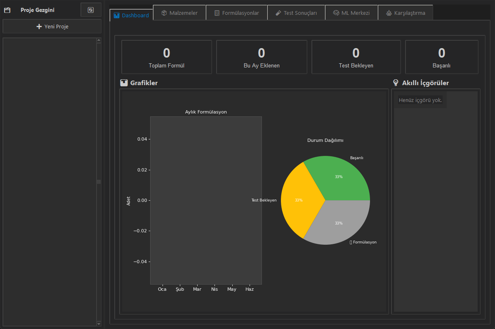
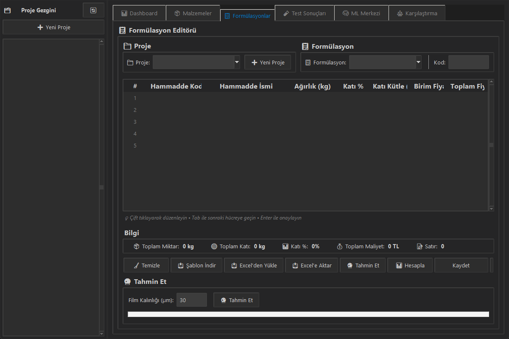
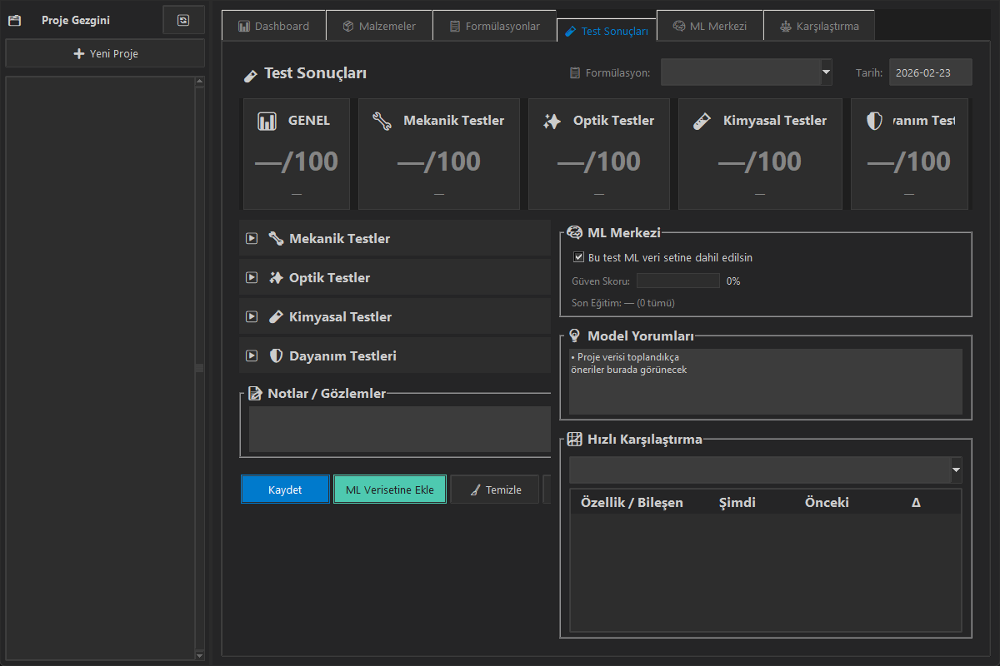
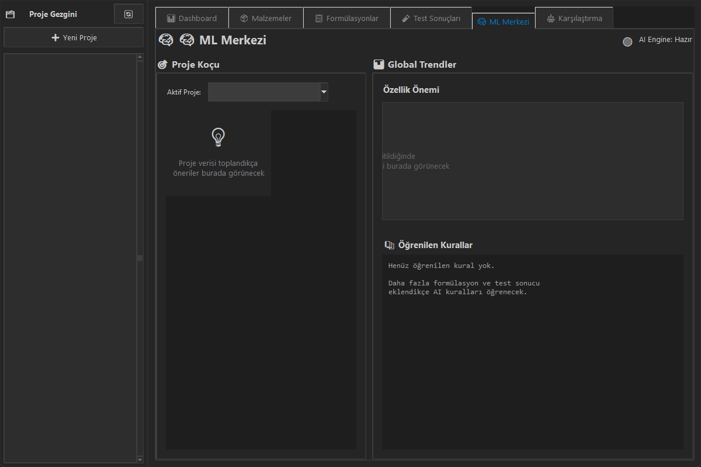

<div align="center">

# 🎨 Paint Formulation AI

[](https://www.python.org/)
[](LICENSE)
[]()

*Where Chemical Engineering meets Data Science - Kimya Mühendisliği ve Veri Biliminin Buluştuğu Yer*

[English](#english) | [Türkçe](#türkçe)

</div>

---

<br>

## <a name="english"></a> 🇬🇧 English

### 📋 About

**Paint Formulation AI** is a desktop application designed for paint and coatings R&D engineers. It streamlines the formulation development process by combining traditional recipe management with machine learning-powered predictions.

Built with Python and Tkinter, this tool helps reduce development cycles by intelligently analyzing historical data to predict coating performance before physical testing. It can work fully offline or in hybrid mode.

### ✨ Features

| Feature | Description |
|---------|-------------|
| 📊 **Smart Dashboard** | Real-time monitoring of R&D metrics and statistics |
| 🧪 **Formulation Editor** | Excel-style grid with real-time cost & solid content calculations |
| 🤖 **ML Predictions** | ML-powered predictions for quality, viscosity, and other tests |
| 💰 **Cost Analysis** | Automatic cost calculation based on material prices |
| 📁 **Project Management** | Hierarchical organization: Projects → Concepts → Trials |
| 📈 **Variation Comparison** | Side-by-side comparison of formulation variations |

### 🖼️ Screenshots

<div align="center">

| **Dashboard** | **Material Management** |
|:---:|:---:|
|  |  |

| **Formulation Editor** | **Test Results & Training** |
|:---:|:---:|
|  |  |

| **ML Center (AI Assistant)** | **Optimization & Comparison** |
|:---:|:---:|
|  |  |

</div>

### 🚀 Installation & Setup

1. **Prerequisites:** Python 3.10 or higher (Windows 10/11 recommended).
2. **Clone the repository:**
   ```bash
   git clone https://github.com/YOUR_USERNAME/paint-formulation-ai.git
   cd paint-formulation-ai
   ```
3. **Setup Virtual Environment:**
   ```bash
   python -m venv venv
   venv\Scripts\activate
   pip install -r requirements.txt
   ```
4. **Run the Application:**
   ```bash
   python app/main.py
   ```

---

<br>

## <a name="türkçe"></a> 🇹🇷 Türkçe

### 📋 Hakkında

**Paint Formulation AI**, boya ve kaplama Ar-Ge mühendisleri için tasarlanmış modern bir masaüstü uygulamasıdır. Geleneksel reçete yönetimini makine öğrenimi destekli tahminlerle birleştirerek formülasyon geliştirme sürecini kolaylaştırır.

Python ve Tkinter kullanılarak geliştirilen bu araç, fiziksel testlerden önce kaplama performansını tahmin etmek için geçmiş verileri akıllıca analiz ederek geliştirme döngülerini ve maliyetleri azaltmaya yardımcı olur. İnternet olmadan da (offline mod) tam yetkiyle çalışabilir.

### ✨ Özellikler

| Özellik | Açıklama |
|---------|-------------|
| 📊 **Akıllı Kontrol Paneli** | Ar-Ge metriklerinin ve istatistiklerinin gerçek zamanlı takibi |
| 🧪 **Formülasyon Editörü** | Gerçek zamanlı maliyet ve katı madde hesaplamalı Excel tarzı tablo |
| 🤖 **ML Tahminleri** | Kalite, viskozite ve parlaklık gibi değerler için Makine öğrenmesi desteği |
| 💰 **Maliyet Analizi** | hammadde fiyatlarına göre otomatik toplam maliyet hesaplaması |
| 📁 **Proje Yönetimi** | Hiyerarşik organizasyon: Projeler → Konseptler → Denemeler |
| 📈 **Varyasyon Karşılaştırması** | Formülasyon varyasyonlarının yan yana karşılaştırılması ve analizi |

### 🖼️ Ekran Görüntüleri

<div align="center">

| **Kontrol Paneli (Dashboard)** | **Hammadde Yönetimi** |
|:---:|:---:|
|  |  |

| **Formülasyon Editörü** | **Test Sonuçları ve Eğitim** |
|:---:|:---:|
|  |  |

| **ML Merkezi (Makine Öğrenmesi)** | **Optimizasyon ve Karşılaştırma** |
|:---:|:---:|
|  |  |

</div>

### 🚀 Kurulum

1. **Gereksinimler:** Python 3.10 veya üzeri (Windows 10/11 önerilir).
2. **Projeyi Klonlayın:**
   ```bash
   git clone https://github.com/YOUR_USERNAME/paint-formulation-ai.git
   cd paint-formulation-ai
   ```
3. **Sanal Ortamı Kurun:**
   ```bash
   python -m venv venv
   venv\Scripts\activate
   pip install -r requirements.txt
   ```
4. **Uygulamayı Çalıştırın:**
   ```bash
   python app/main.py
   ```

---

<br>

## 📦 Tech Stack / Teknoloji Yığını

- **Language:** Python 3.10+
- **GUI:** Tkinter / ttk
- **Database:** SQLite
- **Machine Learning:** XGBoost, Scikit-learn
- **Data Processing:** Pandas, NumPy
- **Excel Support:** openpyxl, xlsxwriter

## 📄 License / Lisans

This project is licensed under the MIT License - see the [LICENSE](LICENSE) file for details. / Bu proje MIT Lisansı altında lisanslanmıştır - detaylar için [LICENSE](LICENSE) dosyasına bakabilirsiniz.

## 👤 Author / Geliştirici

**Kadir AYANA**
- LinkedIn: [www.linkedin.com/in/kadirayana](https://www.linkedin.com/in/kadirayana)
- Email: ayanakadir@hotmail.com

<div align="center">
Made with ❤️ for the Paint & Coatings Industry <br>
Boya ve Kaplama Endüstrisi için ❤️ ile yapılmıştır
</div>
